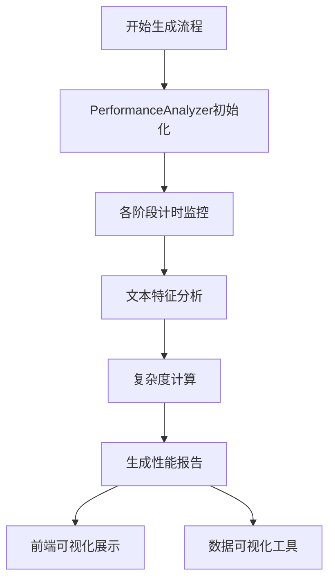

# 📊 计算复杂度分析与性能监控系统

## 🎯 系统概述

本系统为故事生成流程提供完整的性能监控和计算复杂度分析功能，帮助分析和优化生成算法的效率。

### 🔍 计算复杂度分析的关键数据

系统收集以下关键性能数据：

```python
time_complexity_data = {
    'total_generation_time_seconds': float,  # 总生成时间
    'stage_times': {                         # 各阶段耗时
        'outline_generation_duration': float,
        'character_generation_duration': float,
        'expansion_duration': float,
        'dialogue_insertion_duration': float,
        'enhancement_duration': float
    },
    'story_features': {
        'total_word_count': int,             # 文本长度
        'total_char_count': int,
        'chapter_count': int,
        'sentence_count': int
    },
    # 分析目标：拟合 T(n) = a*n^b 的时间复杂度曲线
    'time_complexity_indicator': float       # T(n)/sqrt(n) 或其他复杂度指标
}
```

## 🛠️ 系统架构

### 1. 核心模块

- **`src/analysis/performance_analyzer.py`** - 性能分析核心模块
- **`scripts/performance_visualizer.py`** - 数据可视化工具
- **后端集成** - `main_pipeline_glm.py` 中的性能监控
- **前端界面** - `outline_generator_app.py` 中的分析界面

### 2. 数据流程



## 🚀 快速开始

### 第一步：运行故事生成流程

使用后端流程生成数据：

```bash
# 传统模式
python main_pipeline_glm.py --topic "小红帽" --style "科幻改写" --temperature 0.7 --seed 42

# 自定义描述模式  
python main_pipeline_glm.py --generation-mode description_based --user-description "创作一个科幻故事..." --temperature 0.7
```

### 第二步：查看性能报告

1. **后端自动生成**：每次运行流程会自动在输出目录生成 `performance_analysis_*.json` 文件
2. **前端界面查看**：运行 `streamlit run outline_generator_app.py`，点击侧边栏"📈 查看性能报告"

### 第三步：生成可视化分析

```bash
cd scripts
python performance_visualizer.py
```

## 📊 功能特性

### 1. 实时性能监控

- ⏱️ **各阶段计时**：精确记录每个生成阶段的耗时
- 📈 **实时效率计算**：生成速度（字/秒）实时监控
- 🎯 **复杂度指标**：计算线性、对数线性、二次复杂度指标

### 2. 复杂度分析

#### 时间复杂度拟合
- **线性模型**：T(n) = an + b
- **对数线性模型**：T(n) = an log(n) + b  
- **二次模型**：T(n) = an² + bn + c
- **自动估算**：基于指标自动判断复杂度类别

#### 复杂度指标计算
```python
# 线性复杂度指标
linear_indicator = total_time / total_chars

# 平方根复杂度指标  
sqrt_indicator = total_time / sqrt(total_chars)

# 对数线性复杂度指标
nlogn_indicator = total_time / (total_chars * log(total_chars))
```

### 3. 文本特征分析

- 📝 **基本统计**：字数、句子数、章节数
- 📊 **结构分析**：平均章节长度、句子长度
- 💬 **对话分析**：对话数量、角色数量、对话长度

### 4. 前端可视化界面

#### 🔍 单次分析
- 基本性能指标展示
- 各阶段耗时分解
- 复杂度分析结果
- 文本特征统计

#### 📊 对比分析
- 多版本性能对比
- 效率改善趋势
- 时间改善百分比

#### ⚡ 实时监控
- 生成过程实时进度
- 各阶段状态显示
- 性能异常预警

#### 📋 历史报告
- 历史性能记录查看
- 时间序列趋势分析
- 详细报告导出

### 5. 数据可视化工具

#### 生成图表类型
- **时间复杂度分析图**：时间vs字数散点图，复杂度曲线拟合
- **性能趋势图**：执行时间、效率随时间变化
- **性能热力图**：各指标相关性分析
- **阶段分布图**：各阶段耗时占比饼图

#### 统计分析
```python
{
  "performance_statistics": {
    "execution_time": {
      "mean": 127.5,
      "std": 23.4, 
      "min": 89.1,
      "max": 165.2
    },
    "efficiency": {
      "mean_words_per_second": 12.5,
      "best_efficiency": 18.7,
      "worst_efficiency": 8.3
    }
  },
  "complexity_analysis": {
    "estimated_complexity": "linear",
    "correlation_coefficient": 0.85
  }
}
```

## 📁 文件结构

```
Story/
├── src/analysis/
│   └── performance_analyzer.py          # 核心性能分析模块
├── scripts/
│   └── performance_visualizer.py        # 数据可视化工具
├── main_pipeline_glm.py                 # 后端流程（已集成性能监控）
├── outline_generator_app.py             # 前端界面（已集成分析界面）
├── data/output/
│   └── [version]/
│       ├── performance_analysis_*.json  # 性能分析报告
│       ├── story.json                   # 生成的故事数据
│       └── ...
└── output/
    ├── complexity_analysis_*.png        # 复杂度分析图表
    ├── performance_trends_*.png         # 性能趋势图表
    └── comprehensive_report_*/          # 综合分析报告
        ├── performance_report.html      # HTML报告
        ├── statistical_summary.json    # 统计摘要
        └── *.png                       # 各类图表
```

## 🔧 配置选项

### 性能分析器配置

```python
# 初始化性能分析器
performance_analyzer = PerformanceAnalyzer(task_name="story_generation_v1")

# 开始总计时
performance_analyzer.start_total_timing()

# 阶段计时
performance_analyzer.start_stage("outline_generation", input_params)
# ... 执行生成逻辑 ...
performance_analyzer.end_stage("outline_generation", output_data)

# 分析文本特征
performance_analyzer.analyze_text_features(story_data, dialogue_data)

# 保存报告
performance_analyzer.save_report(output_dir)
```

### 可视化工具配置

```python
# 创建可视化器
visualizer = PerformanceVisualizer(output_dir="output")

# 加载数据并生成报告
visualizer.load_performance_reports("data/output")
report_files = visualizer.generate_comprehensive_report()
```

## 📈 使用示例

### 示例1：分析单次生成的性能

```bash
# 运行生成流程
python main_pipeline_glm.py --topic "科幻小说" --temperature 0.5 --seed 100

# 查看生成的性能报告
ls data/output/科幻小说_改写_linear_T0.5_s100/performance_analysis_*.json

# 使用前端界面分析
streamlit run outline_generator_app.py
# 点击"📈 查看性能报告" -> "📈 单次分析"
```

### 示例2：对比不同参数的性能

```bash
# 生成多组对比数据
python main_pipeline_glm.py --temperature 0.3 --seed 1
python main_pipeline_glm.py --temperature 0.7 --seed 1  
python main_pipeline_glm.py --temperature 0.9 --seed 1

# 前端对比分析
# 在前端界面选择"📊 对比分析"，选择不同temperature的报告进行对比
```

### 示例3：生成可视化分析报告

```bash
# 运行可视化工具
cd scripts
python performance_visualizer.py

# 查看生成的报告
open output/comprehensive_report_*/performance_report.html
```

## 🎯 分析结果解读

### 复杂度类别判断

- **线性 O(n)**：`linear_indicator` 接近常数，时间与文本长度成正比
- **对数线性 O(n log n)**：`nlogn_indicator` 相对稳定
- **超线性**：时间增长超过文本长度增长

### 性能评级标准

| 效率等级 | 字/秒范围 | 评价 |
|---------|----------|------|
| 极快    | >100     | 性能优秀 |
| 快速    | 50-100   | 性能良好 |
| 正常    | 20-50    | 性能一般 |
| 较慢    | 10-20    | 需要优化 |
| 慢     | <10      | 急需优化 |

### 优化建议

根据分析结果，系统会自动生成优化建议：

1. **时间波动大** → 检查网络稳定性和缓存策略
2. **效率下降趋势** → 优化算法或升级硬件
3. **特定阶段耗时** → 针对性优化最慢阶段
4. **复杂度过高** → 考虑算法优化或并行处理

## 🔗 API 参考

### PerformanceAnalyzer 类

```python
class PerformanceAnalyzer:
    def __init__(self, task_name: str)
    def start_total_timing(self)
    def start_stage(self, stage_name: str, input_data: Any = None)
    def end_stage(self, stage_name: str, output_data: Any = None)
    def analyze_text_features(self, story_data: List[Dict], dialogue_data: List[Dict] = None)
    def calculate_complexity_metrics(self) -> Dict
    def generate_performance_report(self) -> Dict
    def save_report(self, output_dir: str, filename: str = None) -> str
```

### PerformanceVisualizer 类

```python
class PerformanceVisualizer:
    def __init__(self, output_dir: str = "output")
    def load_performance_reports(self, data_dir: str = "data/output") -> int
    def plot_time_complexity_analysis(self, save_path: str = None) -> str
    def plot_performance_trends(self, save_path: str = None) -> str
    def generate_performance_heatmap(self, save_path: str = None) -> str
    def generate_comprehensive_report(self, save_dir: str = None) -> Dict[str, str]
```

## 🐛 故障排除

### 常见问题

1. **没有性能报告数据**
   - 确保运行了完整的故事生成流程
   - 检查输出目录权限

2. **可视化图表生成失败**
   - 安装必要依赖：`pip install matplotlib seaborn scipy`
   - 检查数据完整性

3. **前端界面显示异常**
   - 确保Streamlit版本兼容
   - 检查文件路径配置

### 日志调试

系统提供详细的日志输出：
- 性能分析器：在控制台显示阶段耗时
- 可视化工具：显示数据加载和图表生成进度
- 前端界面：提供操作状态反馈

## 📝 更新日志

### v1.0.0 (2024-09-XX)
- ✅ 完整的性能监控系统
- ✅ 时间复杂度分析算法
- ✅ 前端可视化界面
- ✅ 数据可视化工具
- ✅ 综合分析报告生成

---

📊 **性能分析系统** 为您的故事生成提供科学的性能监控和优化指导！
