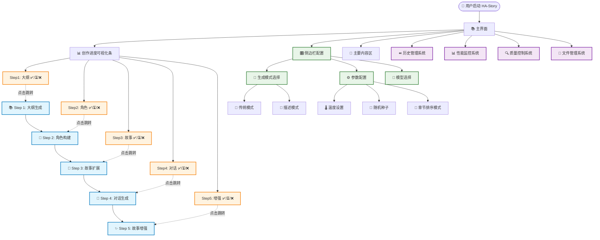
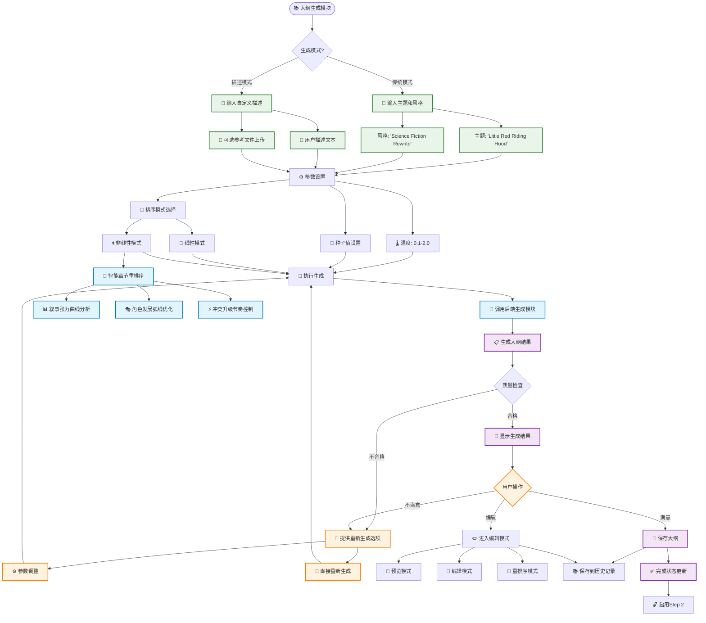
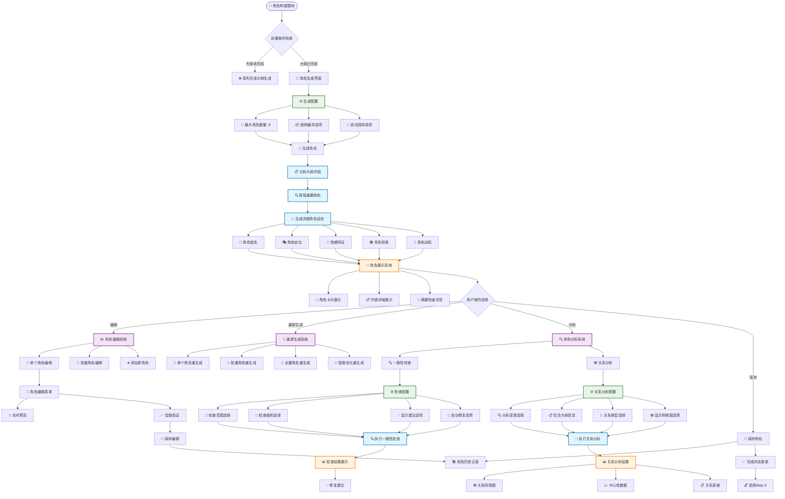
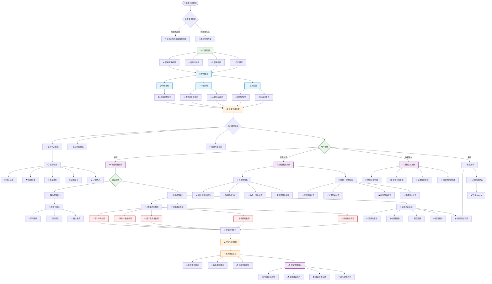
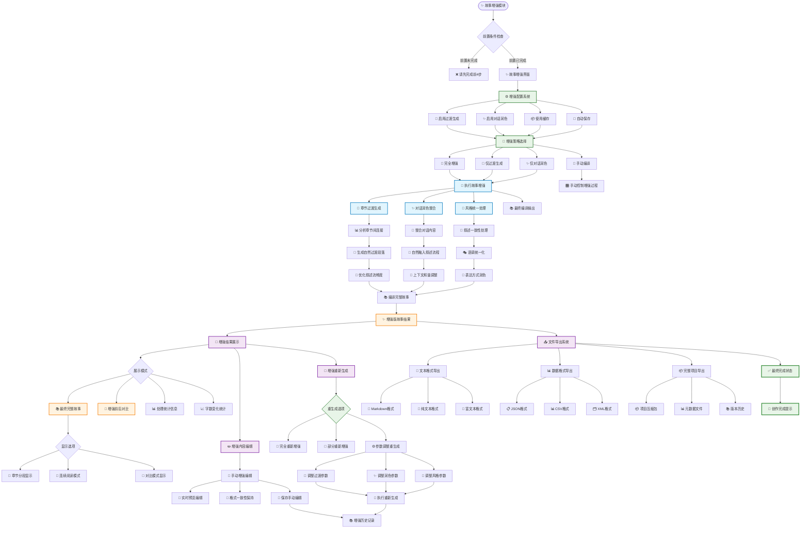

# 🎨 HA-Story完整功能流程图

## 📋 系统整体架构流程图

---

## 🎯 Step 1: 大纲生成模块详细流程

---

## 👥 Step 2: 角色构建模块详细流程

---

## 📖 Step 3: 故事扩展模块详细流程

---

## 💬 Step 4: 对话生成模块详细流程

```mermaid
flowchart TD
    STEP4_START([💬 对话生成模块]) --> PREREQ_CHECK{前置条件检查}
    PREREQ_CHECK -->|前置未完成| ERROR_MSG[❌ 请先完成前3步]
    PREREQ_CHECK -->|前置已完成| DIALOGUE_INTERFACE[💬 对话生成界面]
    
    %% 对话生成界面标签页
    DIALOGUE_INTERFACE --> TAB_SYSTEM[📑 标签页系统]
    TAB_SYSTEM --> TAB_GENERATE[💬 生成对话标签页]
    TAB_SYSTEM --> TAB_PREVIEW[👀 对话预览标签页]
    TAB_SYSTEM --> TAB_EDIT[✏️ 编辑对话标签页]
    TAB_SYSTEM --> TAB_MANAGE[📁 文件管理标签页]
    
    %% 生成配置
    TAB_GENERATE --> DIALOGUE_CONFIG[⚙️ 对话生成配置]
    DIALOGUE_CONFIG --> USE_CACHE[📦 使用缓存]
    DIALOGUE_CONFIG --> BEHAVIOR_MODEL[🤖 行为模型选择]
    DIALOGUE_CONFIG --> AUTO_SAVE[💾 自动保存]
    DIALOGUE_CONFIG --> GENERATION_STRATEGY[🎯 生成策略选择]
    
    %% 生成模式
    GENERATION_STRATEGY --> STANDARD_GEN[📋 标准生成]
    GENERATION_STRATEGY --> CUSTOM_GEN[⚙️ 自定义生成]
    GENERATION_STRATEGY --> INCREMENTAL_GEN[➕ 增量生成]
    
    %% 对话生成执行
    USE_CACHE --> EXECUTE_DIALOGUE_GEN[🚀 执行对话生成]
    BEHAVIOR_MODEL --> EXECUTE_DIALOGUE_GEN
    AUTO_SAVE --> EXECUTE_DIALOGUE_GEN
    STANDARD_GEN --> EXECUTE_DIALOGUE_GEN
    CUSTOM_GEN --> EXECUTE_DIALOGUE_GEN
    INCREMENTAL_GEN --> EXECUTE_DIALOGUE_GEN
    
    %% 核心对话生成技术
    EXECUTE_DIALOGUE_GEN --> SENTENCE_ANALYSIS[📝 句子级精细分析]
    SENTENCE_ANALYSIS --> ANALYZE_INSERTIONS[🔍 分析每个故事句子]
    SENTENCE_ANALYSIS --> NEED_DIALOGUE_CHECK[❓ 判断是否需要对话]
    SENTENCE_ANALYSIS --> CHARACTER_SELECT[👥 智能角色选择]
    
    CHARACTER_SELECT --> DIALOGUE_LOOP[🔄 循环对话生成]
    DIALOGUE_LOOP --> TARGET_ANALYSIS[🎯 分析对话目标]
    DIALOGUE_LOOP --> FIRST_SPEAKER[🗣️ 选择首个发言角色]
    DIALOGUE_LOOP --> GENERATE_UNTIL_END[💬 生成对话直到自然结束]
    DIALOGUE_LOOP --> COMPLETE_SEQUENCE[📋 返回完整对话序列]
    
    %% 行为状态提取
    COMPLETE_SEQUENCE --> BEHAVIOR_EXTRACT[🎭 行为状态提取]
    BEHAVIOR_EXTRACT --> EXTRACT_CHAR_BEHAVIOR[👤 提取角色行为状态]
    BEHAVIOR_EXTRACT --> TRACK_STATE_CHANGES[📊 追踪状态变化]
    
    %% 对话结果处理
    EXTRACT_CHAR_BEHAVIOR --> DIALOGUE_RESULT[💬 对话生成结果]
    TRACK_STATE_CHANGES --> DIALOGUE_RESULT
    
    %% 对话展示系统
    TAB_PREVIEW --> DISPLAY_SYSTEM[📊 对话展示系统]
    DIALOGUE_RESULT --> DISPLAY_SYSTEM
    
    DISPLAY_SYSTEM --> DISPLAY_MODES{展示模式}
    DISPLAY_MODES --> CHAPTER_DIALOGUE[📖 章节对话展示]
    DISPLAY_MODES --> SENTENCE_DIALOGUE[📝 句子对话展示]
    DISPLAY_MODES --> BEHAVIOR_TIMELINE[🎭 行为时间线展示]
    
    %% 章节对话展示
    CHAPTER_DIALOGUE --> CHAPTER_GROUP[📚 章节分组展示]
    CHAPTER_GROUP --> DIALOGUE_STATS[📊 对话统计信息]
    CHAPTER_GROUP --> CHAR_PARTICIPATION[👥 角色参与信息]
    
    %% 句子对话展示
    SENTENCE_DIALOGUE --> SENTENCE_CORRESPOND[📝 句子级对应显示]
    SENTENCE_CORRESPOND --> CONTRAST_DISPLAY[🔄 原文与对话对比]
    SENTENCE_CORRESPOND --> INSERT_MARKERS[📍 清晰标注插入位置]
    
    %% 行为时间线展示
    BEHAVIOR_TIMELINE --> CHAR_DEVELOPMENT[👤 角色发展轨迹]
    BEHAVIOR_TIMELINE --> BEHAVIOR_CHANGES[📈 行为状态变化]
    BEHAVIOR_TIMELINE --> INTERACTION_PATTERN[🤝 互动关系图]
    
    %% 对话编辑系统
    TAB_EDIT --> EDIT_SYSTEM[✏️ 对话编辑系统]
    EDIT_SYSTEM --> EDIT_OPTIONS{编辑选项}
    EDIT_OPTIONS --> PRECISE_EDIT[🎯 精确对话编辑]
    EDIT_OPTIONS --> REGENERATION[🔄 对话重新生成]
    EDIT_OPTIONS --> MANUAL_ADD[➕ 对话手动添加]
    
    %% 精确编辑功能
    PRECISE_EDIT --> SINGLE_DIALOGUE_EDIT[💬 单条对话编辑]
    SINGLE_DIALOGUE_EDIT --> REASSIGN_SPEAKER[🔄 重新分配角色]
    SINGLE_DIALOGUE_EDIT --> EDIT_CONTENT[📝 修改对话内容]
    SINGLE_DIALOGUE_EDIT --> EDIT_ACTION[🎭 编辑动作描述]
    
    %% 对话重新生成
    REGENERATION --> REGEN_OPTIONS{重生成选项}
    REGEN_OPTIONS --> CHAPTER_DIALOGUE_REGEN[📖 单章节对话重生成]
    REGEN_OPTIONS --> ALL_DIALOGUE_REGEN[🔄 全部对话重生成]
    REGEN_OPTIONS --> CHAR_DIALOGUE_REGEN[👤 特定角色对话重生成]
    REGEN_OPTIONS --> SCENE_DIALOGUE_REGEN[🎬 场景对话重生成]
    
    %% 手动添加功能
    MANUAL_ADD --> FREE_INSERT[🆓 自由插入]
    MANUAL_ADD --> CHARACTER_SELECT_ADD[👥 角色选择]
    MANUAL_ADD --> CONTEXT_AWARE[🧠 上下文感知]
    MANUAL_ADD --> FORMAT_AUTO[📐 格式自动化]
    
    %% 文件管理系统
    TAB_MANAGE --> FILE_MANAGEMENT[📁 对话文件管理]
    FILE_MANAGEMENT --> FILE_SAVE[💾 对话数据保存]
    FILE_MANAGEMENT --> FILE_LOAD[📂 对话数据加载]
    
    %% 保存功能
    FILE_SAVE --> PROJECT_SAVE[📁 项目保存]
    FILE_SAVE --> FORMAT_SELECT[📋 格式选择]
    FILE_SAVE --> VERSION_BACKUP[🔄 版本管理]
    FILE_SAVE --> METADATA_RECORD[📊 元数据记录]
    
    %% 加载功能
    FILE_LOAD --> MULTI_FORMAT_SUPPORT[📋 多格式支持]
    FILE_LOAD --> BATCH_LOAD[📦 批量加载]
    FILE_LOAD --> FORMAT_VALIDATE[✅ 格式验证]
    FILE_LOAD --> DATA_MERGE[🔄 数据合并]
    
    %% 历史管理
    SINGLE_DIALOGUE_EDIT --> DIALOGUE_HISTORY[📚 对话历史记录]
    CHAPTER_DIALOGUE_REGEN --> DIALOGUE_HISTORY
    PROJECT_SAVE --> DIALOGUE_HISTORY
    
    %% 完成检查
    PROJECT_SAVE --> COMPLETION_CHECK[✅ 完成状态更新]
    COMPLETION_CHECK --> ENABLE_STEP5[🔓 启用Step 5]

    %% 样式
    classDef configClass fill:#e8f5e8,stroke:#2e7d32,stroke-width:2px
    classDef processClass fill:#e1f5fe,stroke:#0277bd,stroke-width:2px
    classDef systemClass fill:#f3e5f5,stroke:#7b1fa2,stroke-width:2px
    classDef editClass fill:#fff3e0,stroke:#f57c00,stroke-width:2px
    classDef resultClass fill:#ffebee,stroke:#c62828,stroke-width:2px
    
    class DIALOGUE_CONFIG,EDIT_OPTIONS,REGEN_OPTIONS configClass
    class SENTENCE_ANALYSIS,DIALOGUE_LOOP,BEHAVIOR_EXTRACT processClass
    class DISPLAY_SYSTEM,EDIT_SYSTEM,FILE_MANAGEMENT systemClass
    class PRECISE_EDIT,REGENERATION,MANUAL_ADD editClass
    class DIALOGUE_RESULT,BEHAVIOR_TIMELINE,CHAR_DEVELOPMENT resultClass
```

---

## ✨ Step 5: 故事增强模块详细流程

---

## 🔍 5维度质量控制系统流程图

```mermaid
flowchart TD
    QUALITY_START([🔍 5维度质量控制系统]) --> TRIGGER_CONDITIONS{触发条件}
    
    %% 触发条件
    TRIGGER_CONDITIONS -->|故事编辑时| AUTO_TRIGGER[⚡ 自动触发检测]
    TRIGGER_CONDITIONS -->|用户手动| MANUAL_TRIGGER[🔧 手动质量检查]
    TRIGGER_CONDITIONS -->|定时检查| SCHEDULED_CHECK[⏰ 定时质量监控]
    
    %% 检测引擎启动
    AUTO_TRIGGER --> DETECTION_ENGINE[🧠 5维度检测引擎]
    MANUAL_TRIGGER --> DETECTION_ENGINE
    SCHEDULED_CHECK --> DETECTION_ENGINE
    
    %% 5个检测维度并行执行
    DETECTION_ENGINE --> DIM1[🧠 1.语义冲突检测]
    DETECTION_ENGINE --> DIM2[📅 2.事件一致性检测]
    DETECTION_ENGINE --> DIM3[🔗 3.语义连贯性检测]
    DETECTION_ENGINE --> DIM4[💭 4.情感弧线检测]
    DETECTION_ENGINE --> DIM5[👤 5.角色状态检测]
    
    %% 维度1：语义冲突检测
    DIM1 --> SEM_LOGIC[🧠 逻辑矛盾识别]
    DIM1 --> SEM_FACT[📋 事实冲突分析]
    DIM1 --> SEM_BEHAVIOR[👤 角色行为合理性]
    DIM1 --> SEM_SETTING[🌍 设定一致性检查]
    
    SEM_LOGIC --> SEM_RESULT[📊 语义冲突结果]
    SEM_FACT --> SEM_RESULT
    SEM_BEHAVIOR --> SEM_RESULT
    SEM_SETTING --> SEM_RESULT
    
    %% 维度2：事件一致性检测
    DIM2 --> EVENT_TIMELINE[⏰ 时间线验证]
    DIM2 --> EVENT_CAUSAL[🔗 因果关系分析]
    DIM2 --> EVENT_SEQUENCE[📋 事件链完整性]
    DIM2 --> EVENT_SPACE_TIME[🌍 时空一致性检查]
    
    EVENT_TIMELINE --> EVENT_RESULT[📊 事件一致性结果]
    EVENT_CAUSAL --> EVENT_RESULT
    EVENT_SEQUENCE --> EVENT_RESULT
    EVENT_SPACE_TIME --> EVENT_RESULT
    
    %% 维度3：语义连贯性检测
    DIM3 --> COH_CONTEXT[🔗 上下文连接分析]
    DIM3 --> COH_FLUENCY[🌊 叙述流畅度评估]
    DIM3 --> COH_THEME[🎯 主题一致性检查]
    DIM3 --> COH_STYLE[🎨 风格统一性验证]
    
    COH_CONTEXT --> COH_RESULT[📊 连贯性检测结果]
    COH_FLUENCY --> COH_RESULT
    COH_THEME --> COH_RESULT
    COH_STYLE --> COH_RESULT
    
    %% 维度4：情感弧线检测
    DIM4 --> EMO_TRACK[📈 情感发展轨迹追踪]
    DIM4 --> EMO_TURNING[🎭 情感转折合理性]
    DIM4 --> EMO_INTENSITY[💪 情感强度变化分析]
    DIM4 --> EMO_COORD[🤝 多角色情感协调]
    
    EMO_TRACK --> EMO_RESULT[📊 情感弧线结果]
    EMO_TURNING --> EMO_RESULT
    EMO_INTENSITY --> EMO_RESULT
    EMO_COORD --> EMO_RESULT
    
    %% 维度5：角色状态检测
    DIM5 --> CHAR_STATE_TRACK[📊 角色状态追踪]
    DIM5 --> CHAR_BEHAVIOR_CONSIST[👤 行为一致性检查]
    DIM5 --> CHAR_DEVELOP[📈 性格发展分析]
    DIM5 --> CHAR_INTERACT[🤝 互动关系变化]
    
    CHAR_STATE_TRACK --> CHAR_RESULT[📊 角色状态结果]
    CHAR_BEHAVIOR_CONSIST --> CHAR_RESULT
    CHAR_DEVELOP --> CHAR_RESULT
    CHAR_INTERACT --> CHAR_RESULT
    
    %% 结果整合分析
    SEM_RESULT --> INTEGRATE_ANALYSIS[🔧 冲突结果整合分析]
    EVENT_RESULT --> INTEGRATE_ANALYSIS
    COH_RESULT --> INTEGRATE_ANALYSIS
    EMO_RESULT --> INTEGRATE_ANALYSIS
    CHAR_RESULT --> INTEGRATE_ANALYSIS
    
    %% 综合分析报告
    INTEGRATE_ANALYSIS --> CONFLICT_REPORT[📋 综合冲突分析报告]
    CONFLICT_REPORT --> SEVERITY_ASSESS[⚠️ 冲突严重程度评估]
    CONFLICT_REPORT --> IMPACT_ANALYSIS[📈 影响范围分析]
    CONFLICT_REPORT --> PRIORITY_RANK[🏆 修复优先级排序]
    
    %% 智能建议生成
    SEVERITY_ASSESS --> SUGGEST_ENGINE[💡 智能建议生成引擎]
    IMPACT_ANALYSIS --> SUGGEST_ENGINE
    PRIORITY_RANK --> SUGGEST_ENGINE
    
    SUGGEST_ENGINE --> CHAPTER_SUGGESTIONS[📖 章节修改建议]
    SUGGEST_ENGINE --> CHAR_SUGGESTIONS[👥 角色更新建议]
    SUGGEST_ENGINE --> OUTLINE_SUGGESTIONS[📋 大纲结构建议]
    
    %% 建议分类处理
    CHAPTER_SUGGESTIONS --> SUGGEST_MANAGEMENT[📋 建议管理系统]
    CHAR_SUGGESTIONS --> SUGGEST_MANAGEMENT
    OUTLINE_SUGGESTIONS --> SUGGEST_MANAGEMENT
    
    SUGGEST_MANAGEMENT --> SELECT_EXECUTE[☑️ 选择性执行]
    SUGGEST_MANAGEMENT --> BATCH_EXECUTE[📦 批量执行]
    SUGGEST_MANAGEMENT --> PREVIEW_EXECUTE[👀 预览执行]
    SUGGEST_MANAGEMENT --> ROLLBACK_SUPPORT[↩️ 回滚支持]
    
    %% 执行结果反馈
    SELECT_EXECUTE --> FEEDBACK_LOOP[🔄 质量反馈循环]
    BATCH_EXECUTE --> FEEDBACK_LOOP
    PREVIEW_EXECUTE --> FEEDBACK_LOOP
    ROLLBACK_SUPPORT --> FEEDBACK_LOOP
    
    FEEDBACK_LOOP --> RECHECK_QUALITY[🔍 重新质量检查]
    RECHECK_QUALITY -->|仍有问题| DETECTION_ENGINE
    RECHECK_QUALITY -->|质量合格| QUALITY_PASSED[✅ 质量检查通过]

    %% 样式
    classDef dimClass fill:#ffebee,stroke:#c62828,stroke-width:2px
    classDef processClass fill:#e1f5fe,stroke:#0277bd,stroke-width:2px
    classDef resultClass fill:#fff3e0,stroke:#f57c00,stroke-width:2px
    classDef systemClass fill:#f3e5f5,stroke:#7b1fa2,stroke-width:2px
    classDef successClass fill:#e8f5e8,stroke:#388e3c,stroke-width:2px
    
    class DIM1,DIM2,DIM3,DIM4,DIM5 dimClass
    class DETECTION_ENGINE,INTEGRATE_ANALYSIS,SUGGEST_ENGINE processClass
    class SEM_RESULT,EVENT_RESULT,COH_RESULT,EMO_RESULT,CHAR_RESULT,CONFLICT_REPORT resultClass
    class SUGGEST_MANAGEMENT,FEEDBACK_LOOP systemClass
    class QUALITY_PASSED successClass
```

---

## 📊 性能监控系统流程图

```mermaid
flowchart TD
    PERF_START([📊 性能监控系统]) --> MONITOR_INIT[🔧 监控系统初始化]
    
    %% 监控系统启动
    MONITOR_INIT --> START_MONITORING[⚡ 启动多维度监控]
    START_MONITORING --> THREAD_MEMORY[🧠 内存监控线程启动]
    START_MONITORING --> TIME_TRACKER[⏱️ 时间性能追踪器]
    START_MONITORING --> COST_CALCULATOR[💰 成本计算器]
    START_MONITORING --> QUALITY_ANALYZER[📝 质量分析器]
    START_MONITORING --> EFFICIENCY_MONITOR[⚡ 效率监控器]
    START_MONITORING --> RELIABILITY_TRACKER[🛡️ 可靠性追踪器]
    
    %% 1. 时间性能监控
    TIME_TRACKER --> TOTAL_TIME[⏰ 总执行时间]
    TIME_TRACKER --> STAGE_TIME[📊 分阶段时间统计]
    TIME_TRACKER --> API_RESPONSE[🔌 API响应时间]
    TIME_TRACKER --> BOTTLENECK_ID[🔍 瓶颈识别]
    
    %% 2. 内存性能监控（实时监控线程）
    THREAD_MEMORY --> REAL_TIME_MEM[📈 实时内存使用监控]
    REAL_TIME_MEM --> PEAK_MEMORY[📊 峰值内存追踪]
    REAL_TIME_MEM --> MEMORY_GROWTH[📈 内存增长趋势]
    REAL_TIME_MEM --> MEMORY_OPTIMIZE[💡 内存优化建议]
    
    %% 每0.5秒采样一次
    REAL_TIME_MEM --> SAMPLING_LOOP[🔄 每0.5秒采样循环]
    SAMPLING_LOOP --> MEMORY_DATA_COLLECT[📊 内存数据收集]
    MEMORY_DATA_COLLECT --> MEMORY_ANALYSIS[🧮 内存使用分析]
    
    %% 3. 成本性能监控
    COST_CALCULATOR --> API_COST_TRACK[💰 API成本详细追踪]
    API_COST_TRACK --> TOKEN_CONSUMPTION[🎯 Token消耗统计]
    API_COST_TRACK --> CALL_STATISTICS[📞 调用统计分析]
    API_COST_TRACK --> COST_EFFICIENCY[📊 成本效率评估]
    API_COST_TRACK --> COST_OPTIMIZE[💡 成本优化建议]
    
    %% 4. 质量性能监控
    QUALITY_ANALYZER --> TEXT_RICHNESS[📝 文本丰富度分析]
    QUALITY_ANALYZER --> CHAR_COMPLEXITY[👤 角色复杂度评估]
    QUALITY_ANALYZER --> NARRATIVE_STRUCT[📚 叙述结构质量]
    QUALITY_ANALYZER --> LANGUAGE_QUALITY[🗣️ 语言质量评估]
    
    %% 5. 效率性能监控
    EFFICIENCY_MONITOR --> GENERATION_SPEED[⚡ 生成速度计算]
    EFFICIENCY_MONITOR --> PROCESSING_EFFICIENCY[🔧 处理效率分析]
    EFFICIENCY_MONITOR --> RESOURCE_UTILIZATION[📊 资源利用率评估]
    EFFICIENCY_MONITOR --> OPTIMIZATION_SPACE[🔍 优化空间识别]
    
    %% 6. 可靠性性能监控
    RELIABILITY_TRACKER --> API_FAILURE_RATE[⚠️ API失败率统计]
    RELIABILITY_TRACKER --> ERROR_RECOVERY[🔄 错误恢复能力评估]
    RELIABILITY_TRACKER --> STABILITY_INDEX[📊 稳定性指标计算]
    RELIABILITY_TRACKER --> RELIABILITY_IMPROVE[💡 可靠性改进建议]
    
    %% 复杂度分析（数学算法模型）
    MEMORY_ANALYSIS --> COMPLEXITY_ANALYSIS[🧮 复杂度分析算法]
    COMPLEXITY_ANALYSIS --> LINEAR_MODEL[📈 线性复杂度模型]
    COMPLEXITY_ANALYSIS --> NLOGN_MODEL[📊 N-log-N复杂度模型]
    COMPLEXITY_ANALYSIS --> QUADRATIC_MODEL[📈 二次复杂度模型]
    COMPLEXITY_ANALYSIS --> BEST_FIT_MODEL[🎯 最佳拟合模型识别]
    
    %% 性能数据整合
    TOTAL_TIME --> PERFORMANCE_INTEGRATION[📊 性能数据整合中心]
    PEAK_MEMORY --> PERFORMANCE_INTEGRATION
    API_COST_TRACK --> PERFORMANCE_INTEGRATION
    TEXT_RICHNESS --> PERFORMANCE_INTEGRATION
    GENERATION_SPEED --> PERFORMANCE_INTEGRATION
    API_FAILURE_RATE --> PERFORMANCE_INTEGRATION
    BEST_FIT_MODEL --> PERFORMANCE_INTEGRATION
    
    %% 性能报告生成
    PERFORMANCE_INTEGRATION --> REPORT_GENERATOR[📋 性能报告生成器]
    REPORT_GENERATOR --> BASIC_INFO_SUMMARY[📝 基础信息摘要]
    REPORT_GENERATOR --> METRICS_SUMMARY[📊 性能指标汇总]
    REPORT_GENERATOR --> CHART_VISUALIZATION[📈 详细分析图表]
    REPORT_GENERATOR --> OPTIMIZE_RECOMMENDATIONS[💡 优化建议清单]
    
    %% 实时监控界面
    PERFORMANCE_INTEGRATION --> REAL_TIME_DASHBOARD[📊 实时性能仪表板]
    REAL_TIME_DASHBOARD --> LIVE_METRICS[📈 实时指标显示]
    REAL_TIME_DASHBOARD --> ALERT_SYSTEM[⚠️ 性能告警系统]
    REAL_TIME_DASHBOARD --> TREND_ANALYSIS[📊 性能趋势分析]
    
    %% 性能分析模式
    REPORT_GENERATOR --> ANALYSIS_MODES{分析模式选择}
    ANALYSIS_MODES --> SINGLE_SESSION[📋 单独会话分析]
    ANALYSIS_MODES --> COMPARATIVE_ANALYSIS[🔄 对比分析]
    ANALYSIS_MODES --> HISTORICAL_REVIEW[📚 历史性能回顾]
    
    %% 性能优化执行
    OPTIMIZE_RECOMMENDATIONS --> OPTIMIZATION_EXECUTION[🚀 性能优化执行]
    OPTIMIZATION_EXECUTION --> AUTO_OPTIMIZATION[⚡ 自动优化]
    OPTIMIZATION_EXECUTION --> MANUAL_OPTIMIZATION[🔧 手动优化]
    OPTIMIZATION_EXECUTION --> PARAMETER_TUNING[⚙️ 参数调优]

    %% 样式
    classDef monitorClass fill:#e3f2fd,stroke:#1565c0,stroke-width:2px
    classDef analysisClass fill:#fff3e0,stroke:#f57c00,stroke-width:2px
    classDef reportClass fill:#f3e5f5,stroke:#7b1fa2,stroke-width:2px
    classDef systemClass fill:#e8f5e8,stroke:#2e7d32,stroke-width:2px
    
    class TIME_TRACKER,THREAD_MEMORY,COST_CALCULATOR,QUALITY_ANALYZER,EFFICIENCY_MONITOR,RELIABILITY_TRACKER monitorClass
    class COMPLEXITY_ANALYSIS,LINEAR_MODEL,NLOGN_MODEL,QUADRATIC_MODEL,BEST_FIT_MODEL analysisClass
    class REPORT_GENERATOR,BASIC_INFO_SUMMARY,METRICS_SUMMARY,CHART_VISUALIZATION reportClass
    class PERFORMANCE_INTEGRATION,REAL_TIME_DASHBOARD,OPTIMIZATION_EXECUTION systemClass
```

---

## ⏪ 历史管理系统流程图

```mermaid
flowchart TD
    HISTORY_START([⏪ 历史管理系统]) --> HISTORY_INIT[🔧 历史管理初始化]
    
    %% 历史管理初始化
    HISTORY_INIT --> MULTI_LAYER_HISTORY[📚 多层次历史管理]
    MULTI_LAYER_HISTORY --> OUTLINE_HISTORY[📋 大纲历史管理]
    MULTI_LAYER_HISTORY --> CHAR_HISTORY[👥 角色历史管理]
    MULTI_LAYER_HISTORY --> STORY_HISTORY[📖 故事历史管理]
    MULTI_LAYER_HISTORY --> DIALOGUE_HISTORY[💬 对话历史管理]
    MULTI_LAYER_HISTORY --> ENHANCE_HISTORY[✨ 增强历史管理]
    
    %% 大纲历史管理
    OUTLINE_HISTORY --> OUTLINE_OPERATIONS[📝 大纲操作记录]
    OUTLINE_OPERATIONS --> OUTLINE_SNAPSHOTS[📸 大纲版本快照]
    OUTLINE_OPERATIONS --> OUTLINE_DESCRIPTIONS[📋 操作描述记录]
    
    %% 角色历史管理
    CHAR_HISTORY --> CHAR_CHANGE_TRACK[📊 角色变更追踪]
    CHAR_CHANGE_TRACK --> BATCH_OPERATIONS[📦 批量操作记录]
    CHAR_CHANGE_TRACK --> RELATIONSHIP_CHANGES[🕸️ 关系变化历史]
    
    %% 故事历史管理
    STORY_HISTORY --> CHAPTER_MODIFICATIONS[📖 章节修改历史]
    CHAPTER_MODIFICATIONS --> CONFLICT_HISTORY[🔍 冲突检测历史]
    CHAPTER_MODIFICATIONS --> SUGGESTION_HISTORY[💡 智能建议历史]
    
    %% 对话历史管理
    DIALOGUE_HISTORY --> DIALOGUE_GENERATION[💬 对话生成历史]
    DIALOGUE_GENERATION --> DIALOGUE_EDITING[✏️ 对话编辑历史]
    DIALOGUE_GENERATION --> BEHAVIOR_STATE_HISTORY[🎭 行为状态历史]
    
    %% 增强历史管理
    ENHANCE_HISTORY --> ENHANCEMENT_PROCESS[✨ 增强处理历史]
    ENHANCEMENT_PROCESS --> PARAM_CONFIG_HISTORY[⚙️ 参数配置历史]
    ENHANCEMENT_PROCESS --> RESULT_COMPARISON[🔄 结果对比历史]
    
    %% 操作记录机制
    OUTLINE_DESCRIPTIONS --> OPERATION_RECORD[📝 操作记录机制]
    BATCH_OPERATIONS --> OPERATION_RECORD
    CONFLICT_HISTORY --> OPERATION_RECORD
    DIALOGUE_EDITING --> OPERATION_RECORD
    PARAM_CONFIG_HISTORY --> OPERATION_RECORD
    
    OPERATION_RECORD --> ACTION_TIMESTAMP[⏰ 操作时间戳]
    OPERATION_RECORD --> ACTION_TYPE[🏷️ 操作类型标识]
    OPERATION_RECORD --> ACTION_DETAILS[📝 操作详细内容]
    OPERATION_RECORD --> STATE_SNAPSHOT[📸 状态快照保存]
    
    %% 统一撤销重做控制
    ACTION_TIMESTAMP --> UNIFIED_CONTROL[🎛️ 统一撤销重做控制]
    ACTION_TYPE --> UNIFIED_CONTROL
    ACTION_DETAILS --> UNIFIED_CONTROL
    STATE_SNAPSHOT --> UNIFIED_CONTROL
    
    UNIFIED_CONTROL --> GLOBAL_UNDO[↩️ 全局撤销功能]
    UNIFIED_CONTROL --> GLOBAL_REDO[↪️ 全局重做功能]
    UNIFIED_CONTROL --> MODULE_UNDO[🎯 模块化撤销重做]
    UNIFIED_CONTROL --> PRECISE_ROLLBACK[🎯 精确操作回滚]
    
    %% 全局操作控制
    GLOBAL_UNDO --> AUTO_MODULE_DETECT[🔍 自动模块识别]
    GLOBAL_REDO --> AUTO_MODULE_DETECT
    AUTO_MODULE_DETECT --> CROSS_MODULE_SUPPORT[🔄 跨模块操作支持]
    
    %% 模块化控制
    MODULE_UNDO --> OUTLINE_MODULE_UNDO[📋 大纲模块撤销]
    MODULE_UNDO --> CHAR_MODULE_UNDO[👥 角色模块撤销]
    MODULE_UNDO --> STORY_MODULE_UNDO[📖 故事模块撤销]
    MODULE_UNDO --> DIALOGUE_MODULE_UNDO[💬 对话模块撤销]
    MODULE_UNDO --> ENHANCE_MODULE_UNDO[✨ 增强模块撤销]
    
    %% 历史面板展示
    UNIFIED_CONTROL --> HISTORY_PANEL[📊 历史面板展示]
    HISTORY_PANEL --> TIMELINE_DISPLAY[📅 操作时间线]
    TIMELINE_DISPLAY --> TYPE_ICONS[🏷️ 操作类型图标]
    TIMELINE_DISPLAY --> DETAIL_DESCRIPTIONS[📝 详细操作描述]
    TIMELINE_DISPLAY --> QUICK_JUMP[⚡ 快速跳转功能]
    
    %% 历史面板交互
    TYPE_ICONS --> HISTORY_INTERACTION[🎛️ 历史面板交互]
    DETAIL_DESCRIPTIONS --> HISTORY_INTERACTION
    QUICK_JUMP --> HISTORY_INTERACTION
    
    HISTORY_INTERACTION --> STATE_PREVIEW[👀 状态预览]
    HISTORY_INTERACTION --> DIRECT_JUMP[🎯 直接跳转到历史状态]
    HISTORY_INTERACTION --> HISTORY_COMPARE[🔄 历史版本对比]
    HISTORY_INTERACTION --> BATCH_ROLLBACK[📦 批量回滚操作]
    
    %% 版本管理
    STATE_SNAPSHOT --> VERSION_MANAGEMENT[📚 版本管理系统]
    VERSION_MANAGEMENT --> AUTO_BACKUP[🔄 自动版本备份]
    VERSION_MANAGEMENT --> VERSION_TAGS[🏷️ 版本标签管理]
    VERSION_MANAGEMENT --> VERSION_BRANCH[🌿 版本分支管理]
    
    %% 历史数据持久化
    VERSION_MANAGEMENT --> PERSISTENCE[💾 历史数据持久化]
    PERSISTENCE --> LOCAL_STORAGE[💽 本地存储]
    PERSISTENCE --> SESSION_RECOVERY[🔄 会话恢复]
    PERSISTENCE --> HISTORY_CLEANUP[🧹 历史数据清理]
    
    %% 历史分析
    HISTORY_PANEL --> HISTORY_ANALYTICS[📊 历史分析功能]
    HISTORY_ANALYTICS --> USAGE_PATTERNS[📈 使用模式分析]
    HISTORY_ANALYTICS --> FREQUENT_OPERATIONS[🔄 频繁操作识别]
    HISTORY_ANALYTICS --> EFFICIENCY_INSIGHTS[💡 效率洞察]

    %% 样式
    classDef historyClass fill:#e8f5e8,stroke:#2e7d32,stroke-width:2px
    classDef controlClass fill:#e1f5fe,stroke:#0277bd,stroke-width:2px
    classDef panelClass fill:#f3e5f5,stroke:#7b1fa2,stroke-width:2px
    classDef systemClass fill:#fff3e0,stroke:#f57c00,stroke-width:2px
    
    class OUTLINE_HISTORY,CHAR_HISTORY,STORY_HISTORY,DIALOGUE_HISTORY,ENHANCE_HISTORY historyClass
    class UNIFIED_CONTROL,GLOBAL_UNDO,GLOBAL_REDO,MODULE_UNDO controlClass
    class HISTORY_PANEL,TIMELINE_DISPLAY,HISTORY_INTERACTION panelClass
    class VERSION_MANAGEMENT,PERSISTENCE,HISTORY_ANALYTICS systemClass
```

---

## 🎯 用户交互完整流程图

```mermaid
flowchart TD
    USER_START([👤 用户启动系统]) --> WELCOME_SCREEN[🏠 欢迎界面]
    
    %% 欢迎界面选项
    WELCOME_SCREEN --> INTERACTION_OPTIONS{交互选项}
    INTERACTION_OPTIONS --> NEW_PROJECT[🆕 创建新项目]
    INTERACTION_OPTIONS --> LOAD_PROJECT[📂 加载现有项目]
    INTERACTION_OPTIONS --> PERFORMANCE_VIEW[📊 查看性能报告]
    INTERACTION_OPTIONS --> EXAMPLE_VIEW[📚 查看示例格式]
    
    %% 新项目创建
    NEW_PROJECT --> PROJECT_CONFIG[⚙️ 项目配置]
    PROJECT_CONFIG --> MODE_SELECT[📝 选择生成模式]
    PROJECT_CONFIG --> PARAM_CONFIG[🎛️ 参数配置]
    PROJECT_CONFIG --> START_CREATION[🚀 开始创作]
    
    %% 主创作流程
    START_CREATION --> PROGRESS_INTERFACE[📊 创作进度界面]
    PROGRESS_INTERFACE --> STEP_NAVIGATION{步骤导航}
    
    %% 5步创作流程用户体验
    STEP_NAVIGATION --> STEP1_UX[📚 Step1: 大纲生成用户体验]
    STEP_NAVIGATION --> STEP2_UX[👥 Step2: 角色构建用户体验]
    STEP_NAVIGATION --> STEP3_UX[📖 Step3: 故事扩展用户体验]
    STEP_NAVIGATION --> STEP4_UX[💬 Step4: 对话生成用户体验]
    STEP_NAVIGATION --> STEP5_UX[✨ Step5: 故事增强用户体验]
    
    %% Step1 用户体验
    STEP1_UX --> STEP1_INPUT[📝 输入配置]
    STEP1_INPUT --> STEP1_GENERATE[🚀 一键生成]
    STEP1_GENERATE --> STEP1_RESULT[📋 结果展示]
    STEP1_RESULT --> STEP1_ACTIONS{用户行动}
    STEP1_ACTIONS -->|满意| STEP1_SAVE[💾 保存并继续]
    STEP1_ACTIONS -->|不满意| STEP1_REGEN[🔄 无限重生成]
    STEP1_ACTIONS -->|编辑| STEP1_EDIT[✏️ 编辑调整]
    
    STEP1_REGEN --> STEP1_GENERATE
    STEP1_EDIT --> STEP1_RESULT
    STEP1_SAVE --> STEP2_ENABLE[🔓 启用Step2]
    
    %% Step2 用户体验
    STEP2_UX --> STEP2_CONFIG[⚙️ 角色配置]
    STEP2_CONFIG --> STEP2_GENERATE[🚀 角色生成]
    STEP2_GENERATE --> STEP2_DISPLAY[👥 角色展示]
    STEP2_DISPLAY --> STEP2_ACTIONS{用户选择}
    STEP2_ACTIONS -->|编辑角色| STEP2_EDIT[✏️ 角色编辑]
    STEP2_ACTIONS -->|重新生成| STEP2_REGEN[🔄 角色重生成]
    STEP2_ACTIONS -->|关系分析| STEP2_ANALYSIS[🕸️ 关系分析]
    STEP2_ACTIONS -->|一致性检查| STEP2_CHECK[🔍 一致性检查]
    STEP2_ACTIONS -->|保存继续| STEP2_SAVE[💾 保存并继续]
    
    STEP2_EDIT --> STEP2_DISPLAY
    STEP2_REGEN --> STEP2_GENERATE
    STEP2_ANALYSIS --> STEP2_DISPLAY
    STEP2_CHECK --> STEP2_DISPLAY
    STEP2_SAVE --> STEP3_ENABLE[🔓 启用Step3]
    
    %% Step3 用户体验（关键智能编辑体验）
    STEP3_UX --> STEP3_CONFIG[⚙️ 扩展配置]
    STEP3_CONFIG --> STEP3_GENERATE[🚀 故事扩展]
    STEP3_GENERATE --> STEP3_DISPLAY[📖 故事展示]
    STEP3_DISPLAY --> STEP3_ACTIONS{用户操作}
    STEP3_ACTIONS -->|基础编辑| STEP3_BASIC_EDIT[📝 基础编辑]
    STEP3_ACTIONS -->|智能编辑| STEP3_SMART_EDIT[🧠 智能编辑]
    STEP3_ACTIONS -->|质量检查| STEP3_QUALITY[🔍 质量检查]
    STEP3_ACTIONS -->|重新生成| STEP3_REGEN[🔄 章节重生成]
    STEP3_ACTIONS -->|保存继续| STEP3_SAVE[💾 保存并继续]
    
    %% 智能编辑用户体验（系统核心创新）
    STEP3_SMART_EDIT --> SMART_EDIT_PROCESS[🧠 智能编辑处理]
    SMART_EDIT_PROCESS --> CONFLICT_AUTO_DETECT[⚡ 自动冲突检测]
    CONFLICT_AUTO_DETECT --> SUGGESTION_PRESENT[💡 智能建议展示]
    SUGGESTION_PRESENT --> USER_CHOOSE_SUGGESTIONS{用户选择建议}
    USER_CHOOSE_SUGGESTIONS -->|执行建议| EXECUTE_SUGGESTIONS[✅ 执行智能建议]
    USER_CHOOSE_SUGGESTIONS -->|忽略建议| IGNORE_SUGGESTIONS[❌ 忽略建议]
    USER_CHOOSE_SUGGESTIONS -->|自定义修改| CUSTOM_MODIFY[🔧 自定义修改]
    
    EXECUTE_SUGGESTIONS --> CASCADE_UPDATE[🔄 级联更新]
    CASCADE_UPDATE --> UPDATE_RESULT[📊 更新结果展示]
    UPDATE_RESULT --> STEP3_DISPLAY
    
    STEP3_BASIC_EDIT --> STEP3_DISPLAY
    STEP3_QUALITY --> STEP3_DISPLAY
    STEP3_REGEN --> STEP3_GENERATE
    STEP3_SAVE --> STEP4_ENABLE[🔓 启用Step4]
    
    %% Step4 用户体验
    STEP4_UX --> STEP4_TABS[📑 对话界面标签页]
    STEP4_TABS --> STEP4_GEN_TAB[💬 生成标签页]
    STEP4_TABS --> STEP4_PREVIEW_TAB[👀 预览标签页]
    STEP4_TABS --> STEP4_EDIT_TAB[✏️ 编辑标签页]
    STEP4_TABS --> STEP4_FILE_TAB[📁 文件标签页]
    
    STEP4_GEN_TAB --> STEP4_GENERATE[🚀 对话生成]
    STEP4_GENERATE --> STEP4_RESULT[💬 对话结果]
    STEP4_RESULT --> STEP4_ACTIONS{用户操作}
    STEP4_ACTIONS -->|编辑对话| STEP4_EDIT[✏️ 对话编辑]
    STEP4_ACTIONS -->|重新生成| STEP4_REGEN[🔄 对话重生成]
    STEP4_ACTIONS -->|添加对话| STEP4_ADD[➕ 添加对话]
    STEP4_ACTIONS -->|保存继续| STEP4_SAVE[💾 保存并继续]
    
    STEP4_EDIT --> STEP4_RESULT
    STEP4_REGEN --> STEP4_GENERATE
    STEP4_ADD --> STEP4_RESULT
    STEP4_SAVE --> STEP5_ENABLE[🔓 启用Step5]
    
    %% Step5 用户体验
    STEP5_UX --> STEP5_CONFIG[⚙️ 增强配置]
    STEP5_CONFIG --> STEP5_GENERATE[🚀 故事增强]
    STEP5_GENERATE --> STEP5_RESULT[✨ 增强结果]
    STEP5_RESULT --> STEP5_ACTIONS{用户操作}
    STEP5_ACTIONS -->|手动编辑| STEP5_EDIT[✏️ 手动编辑]
    STEP5_ACTIONS -->|重新增强| STEP5_REGEN[🔄 重新增强]
    STEP5_ACTIONS -->|导出文件| STEP5_EXPORT[📤 导出文件]
    STEP5_ACTIONS -->|完成创作| STEP5_COMPLETE[🎉 完成创作]
    
    STEP5_EDIT --> STEP5_RESULT
    STEP5_REGEN --> STEP5_GENERATE
    STEP5_EXPORT --> EXPORT_SYSTEM[📤 文件导出系统]
    STEP5_COMPLETE --> SUCCESS_SCREEN[🎉 成功完成界面]
    
    %% 全局用户体验功能
    PROGRESS_INTERFACE --> GLOBAL_UX{全局用户体验}
    GLOBAL_UX --> HISTORY_PANEL_UX[⏪ 历史面板]
    GLOBAL_UX --> PERFORMANCE_MONITOR_UX[📊 性能监控]
    GLOBAL_UX --> HELP_SYSTEM_UX[❓ 帮助系统]
    GLOBAL_UX --> QUICK_ACTIONS_UX[⚡ 快捷操作]
    
    %% 历史面板用户体验
    HISTORY_PANEL_UX --> UNDO_REDO_UX[↩️↪️ 撤销重做]
    HISTORY_PANEL_UX --> HISTORY_BROWSE_UX[📚 历史浏览]
    HISTORY_PANEL_UX --> STATE_JUMP_UX[🎯 状态跳转]
    
    %% 帮助系统用户体验
    HELP_SYSTEM_UX --> CONTEXT_HELP[🎯 上下文帮助]
    HELP_SYSTEM_UX --> OPERATION_GUIDE[📋 操作指导]
    HELP_SYSTEM_UX --> ERROR_HELP[⚠️ 错误帮助]
    HELP_SYSTEM_UX --> SUCCESS_FEEDBACK[✅ 成功反馈]
    
    %% 响应式用户体验设计
    GLOBAL_UX --> RESPONSIVE_DESIGN[📱 响应式设计]
    RESPONSIVE_DESIGN --> ADAPTIVE_INTERFACE[🖥️ 自适应界面]
    RESPONSIVE_DESIGN --> MODULAR_LAYOUT[📐 模块化布局]
    RESPONSIVE_DESIGN --> COLLAPSIBLE_PANELS[🔽 可折叠面板]
    RESPONSIVE_DESIGN --> QUICK_SHORTCUTS[⚡ 快捷操作]

    %% 样式
    classDef userClass fill:#e8f5e8,stroke:#2e7d32,stroke-width:2px
    classDef stepClass fill:#e1f5fe,stroke:#0277bd,stroke-width:2px
    classDef actionClass fill:#fff3e0,stroke:#f57c00,stroke-width:2px
    classDef systemClass fill:#f3e5f5,stroke:#7b1fa2,stroke-width:2px
    classDef successClass fill:#e8f5e8,stroke:#388e3c,stroke-width:3px
    
    class USER_START,WELCOME_SCREEN,NEW_PROJECT,LOAD_PROJECT userClass
    class STEP1_UX,STEP2_UX,STEP3_UX,STEP4_UX,STEP5_UX stepClass
    class STEP1_ACTIONS,STEP2_ACTIONS,STEP3_ACTIONS,STEP4_ACTIONS,STEP5_ACTIONS actionClass
    class SMART_EDIT_PROCESS,GLOBAL_UX,RESPONSIVE_DESIGN systemClass
    class STEP5_COMPLETE,SUCCESS_SCREEN successClass
```

## 📋 总结

这个完整的流程图系统展示了**HA-Story的全貌**，包含：

### 🎯 **主要特色**
1. **5步渐进式创作流程**：每步都有详细的用户交互和功能模块
2. **5维度质量控制系统**：业界领先的智能冲突检测引擎
3. **6维度性能监控系统**：企业级实时性能分析
4. **无限重生成能力**：每个环节都支持无限次重新生成
5. **智能编辑系统**：核心创新的智能建议和级联更新

### 🔧 **技术亮点**
- **多线程内存监控**：每0.5秒采样的实时监控
- **复杂度数学建模**：线性、N-log-N、二次复杂度模型拟合
- **智能冲突检测**：5个维度的并行检测和结果整合
- **级联更新机制**：智能建议执行和影响传播
- **多层次历史管理**：跨模块的统一撤销重做系统

### 🎨 **用户体验**
- **直观的进度可视化**：5步创作流程清晰展示
- **响应式界面设计**：自适应、模块化、可折叠
- **智能操作辅助**：上下文帮助、操作指导、错误提示
- **无缝交互流程**：从欢迎界面到完成创作的完整体验

这个流程图系统完整地展示了**HA-Story作为企业级AI创作工具的复杂性和先进性**！
